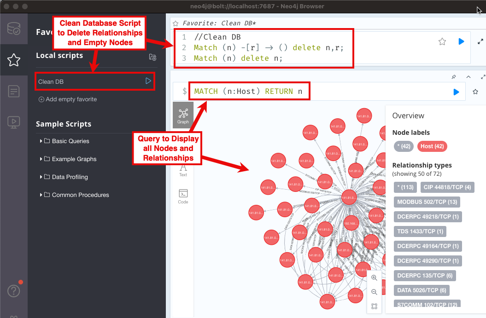

# ICS Packet Capture Visualizer
A packet capture visualizer for industrial control networks. This project takes a network packet capture file (PCAP), processes the packets using `pyshark`, and sends information about the traffic to a Neo4j database. The Neo4j browsers and tools can be used to visualize and interact with the network information collected from the PCAP.

Visualization of network communications provides with the development and review of network and data flow diagrams. This tool uses the local network traffic to generate these diagrams while also providing details about the true nature of communications. Visualizing the network traffic can help identify instances of `shadow`, or even rogue, systems and devices.

IMPORTANT NOTE: You will need to learn how to use Neo4j to manually process this information. Populating the database is only the first step. There is more work once the script has completed. Don't be scared.

This project also provides the ability to process PCAP files for valuable information about the communications between hosts. The `icspcaplists.py` script allows the user to review the network traffic for specific types of data that will generate inventory lists, protocol identifiers, and extracting authentication credentials.

# Usage
## Visualization Processing Examples
### Help Message
```
(venv) ┌──CUTSEC - 22-10-18 0:20:06
└─$ python icspcapviz.py -h
usage: icspcapviz.py [-h] [-d] [-v] [-f [PCAP]] [-j [JSONDIR]] [-p ADMIN] [-t] [-u] [-a] [-i] [-n [NODENAME]] [-F [DISPLAY_FILTER]]

Analyze network packet captures and map hosts.

optional arguments:
  -h, --help            show this help message and exit
  -d, --debug           Print debugging statements
  -v, --version         Print version
  -f [PCAP], --file [PCAP]
                        Path to network packet capture file
  -j [JSONDIR], --json [JSONDIR]
                        Path to directory to write JSON files
  -p ADMIN, --neopasswd ADMIN
                        Password for Neo4J database (Default: admin)
  -t, --tcp             Disable processing TCP packets
  -u, --udp             Disable processing UDP packets
  -a, --arp             Disable processing ARP packets
  -i, --icmp            Disable processing ICMP packets
  -n [NODENAME], --nodename [NODENAME]
                        Names for nodes in Neo4j (Default: Host)
  -F [DISPLAY_FILTER], --filter [DISPLAY_FILTER]
                        Wireshark / Tshark display filter
```

## Graph TCP traffic only
```
┌──CUTSEC - 22-09-09 17:54:20
└─$ ./icsPcapViz.py -f ./Plant1.pcap
```

## Graph TCP and UDP traffic
```
┌──CUTSEC - 22-09-09 17:56:40
└─$ ./icsPcapViz.py -f ./Plant1.pcap -u
```

## Graph UDP traffic only
```
┌──CUTSEC - 22-09-09 17:59:23
└─$ ./icsPcapViz.py -f ./Plant1.pcap -t -u
```

## Neo4j Usage
### Neo4j Bloom Graph


**NOTE: These nodes were manually organized.**

### Install and Review Neo4j documentation
* Install Neo4j: https://neo4j.com/docs/operations-manual/current/installation/
* Neo4j Quick Start: https://neo4j.com/developer/get-started/
* Neo4j Bloom Quick Start: https://neo4j.com/docs/bloom-user-guide/current/bloom-quick-start/

### Start a Neo4j Project and Database
* Stop any running databases.
* Create a new project and name the project 'ICSPcapViz' or something related to your task.
* Add a new database and name it 'ICSPcapViz' or something related to your task.
  * When prompted set the password to 'admin' (the ICSPcapViz default) or you will need to proved the password to the script.
* Start database.
* Open the Neo4j browser for the database.
* Create a script to clear the database, see below. - you may do several runs, this script will help.

### Clear Neo4j Database Script
```
// Clean DB
// Remove all node relationships
Match (n) -[r] -> () delete n,r;
// Remove all remaining nodes
Match (n) delete n;
```

## Populating and Using Database
* Run the 'ICSPcapViz' script
* Check database contents using the Neo4j browser with the query `MATCH (n) RETURN n`
* Use the Neo4j Bloom browser to review the data
  * Select `HOST---HOST`
  * Move nodes around
  * Search for specific nodes or relationships
  * Export data
  * Export an image (visualize) the network



## Inventory Processing Examples
### Help Message
The ICS PCAP List script will analyze a network packet capture file and generate different lists based on protocols, credentials, and inventory.
```
(venv) ┌──CUTSEC - 22-10-18 0:23:18
└─$ python icspcaplists.py -h
usage: icspcaplists.py [-h] [-d] [-v] -f [PCAP] [-w [WORDLIST]] [-F [DISPLAY_FILTER]] [-c [{all,ntlm,http,kerberos}]] [-p [{all,dnp3data,dnp3sav5}]]
                       [-i [{all,protocols,hardware,services,raw,entropy}]]

Analyze network packet captures and map hosts.

optional arguments:
  -h, --help            show this help message and exit
  -d, --debug           Print debugging statements
  -v, --version         Print version
  -f [PCAP], --file [PCAP]
                        Path to network packet capture file
  -w [WORDLIST], --wordlist [WORDLIST]
                        Path to file with list of words for passwords
  -F [DISPLAY_FILTER], --filter [DISPLAY_FILTER]
                        Wireshark / Tshark display filter
  -c [{all,ntlm,http,kerberos}], --creds [{all,ntlm,http,kerberos}]
                        Locate and print output for credentials. Choices: 'all': Default, run all modules. 'ntlm': process ntlmssp module. 'http':
                        process HTTP Basic Auth module. 'kerberos': process kerberos module.
  -p [{all,dnp3data,dnp3sav5}], --protos [{all,dnp3data,dnp3sav5}]
                        Locate and print output for ICS protocols. Choices: 'all': Default, process all ICS protocol modules. 'dnp3data': process
                        DNP3 data module to show data chunks. 'dnp3sav5': process DNP3 SAv5 module to list Secure Authentication version 5 challenge
                        and response in PWDump format.
  -i [{all,protocols,hardware,services,raw,entropy}], --inventory [{all,protocols,hardware,services,raw,entropy}]
                        Locate and print output for ICS protocols. Choices: 'all': Default, process all inventory modules. 'protocols': list all
                        protocols. 'hardware': list all hardware addresses and IP addresses. 'services': list all services with IP addresses. 'raw':
                        show raw bytes for packets with unknown data. 'entropy': show entropy values for packets with unknown data to detect
                        encryption or compression.
```

# Getting Started
## Installation

* Clone repository
* Change directory into the repository
* Install requirements using `pip install -r requirements.txt`
  * [pyshark](https://pypi.org/project/pyshark/) 
  * [py2neo](https://pypi.org/project/py2neo/) 

## Testing PCAPs

* [ControlThings Industrial Protocol PCAPS](https://github.com/ControlThings-io/ct-samples/tree/master/Protocols)
  * [Plant1](https://github.com/ControlThings-io/ct-samples/raw/master/Protocols/Combined/Plant1.pcap) - network traffic from a manufacturing plant which contains MODBUS, ENIP/CIP, Profinet, and other protocols
  * [CounterHack Holiday Hacking Challenge 2013](https://github.com/ControlThings-io/ct-samples/raw/master/Protocols/Combined/SANS_HolidayHack_2013.pcap) - network traffic with a lot of hosts, includes MODBUS traffic (can you find it using Neo4j Bloom?)
* [ITI Industrial PCAPs](https://github.com/ITI/ICS-Security-Tools/tree/master/pcaps)
  * [Plant1](https://github.com/ITI/ICS-Security-Tools/raw/master/pcaps/Combined/Plant1.pcap) - network traffic from a manufacturing plant which contains MODBUS, ENIP/CIP, Profinet, and other protocols

# Development
Here are some helpful hints to help with packet parsing and protocol layers using PyShark.

## Identifying protocol layers within a PCAP
Use the following code block in iPython to output the layers for each packet. More advanced searches can be performed by using filtering.

```
import os,sys,re
import pyshark
inf = "./Plant1.pcap"
#inf = "./sansholidayhack2013.pcap"
packets = pyshark.FileCapture(inf)
num_packets = 10

cnt = 0
for p in packets:
    print(p.layers)
    cnt = cnt +1
    if cnt == num_packets: break
```


# Scripts

The scripts directory contains a number of Python script that use PyShark to process the PCAP and obtain useful information.

* DNP3 - process DNP3 communications
* Credentials - analyze traffic for credentials
* Inventory - generate asset lists from host and communication data

# TODO
* Move DNP3 SAv5 to credentials.
* Fix processing unknown data to show raw bytes and entropy.
* Add hardware vendor information to inventory scripts.
* Add ICMP, ARP, IPv6 processing.
* Add Ethernet processing, for Profinet and IEC61850.

# Recognition

Thank you to the following people for their help, input, and testing.

* CutSec Discord
* Tom Liston
* John H. Sawyer
* Vineet Prakash 

# Similar Projects
* [multiplex3r/loadPcap.py](https://gist.github.com/multiplex3r/a04a8cfc1dcedb2e5553ff7c850c9450) - great starting point using SCAPY
* [NetFrenzy](https://github.com/CoalfireFederal/NetFrenzy)
* [Packet Communication Investigator](https://github.com/michoo/pci)
* [PCAP Visualization Tool](https://github.com/Sh3lldor/PVT)